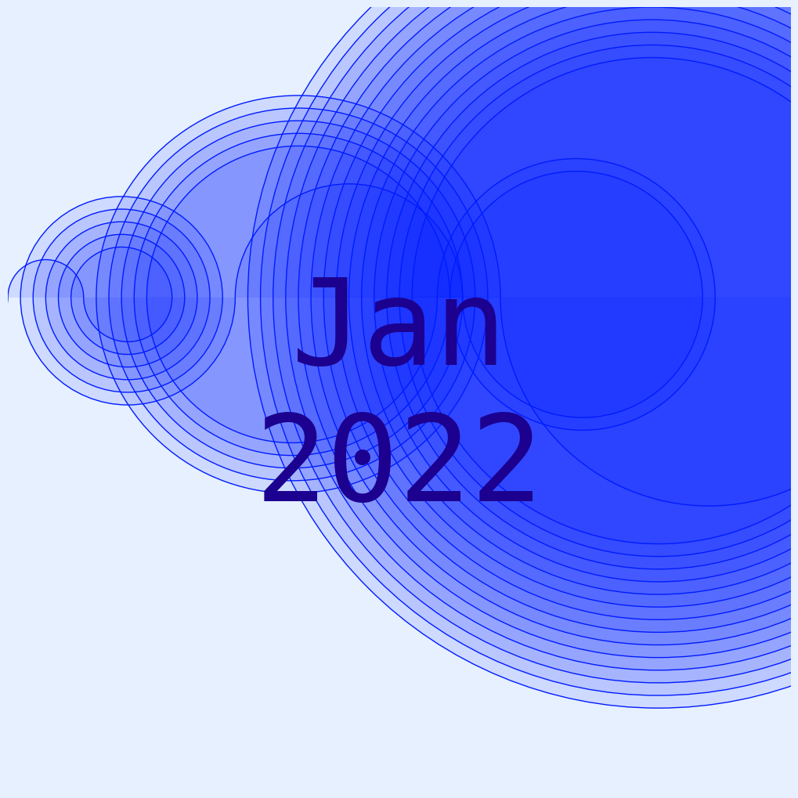

# Your Tops

This is a simple script that creates a playlist of your top songs of the past approximately 4 weeks on Spotify.
It also adds a randomized cover image (a visualization of the Recáman's Sequence).

## Configuration
To get this working you need to create a configuration file ``config.json`` with the following structure:

```json
{
  "tokens": [
    {
      "refresh_token": "Refresh token for your spotify account with correct scopes"
    }
  ],
  "client_id": "",
  "client_secret": "",
  "spotify_api_url": ""
}
```
After installing the required dependencies just run ``python script.py`` and enjoy your top list!

### Scopes
The refresh token needs to have the following scopes: ``playlist-modify-private playlist-modify-public user-top-read ugc-image-upload``

## Considerations and future plans
Currently this implementation relies on the user to be familiar enough with the SpotifyAPI to be able to create their own tokens.
In the future I want to setup for example a Flask server to allow the user to just login with their credentials and create
playlists.

## Example Cover images
Here are some example cover images




