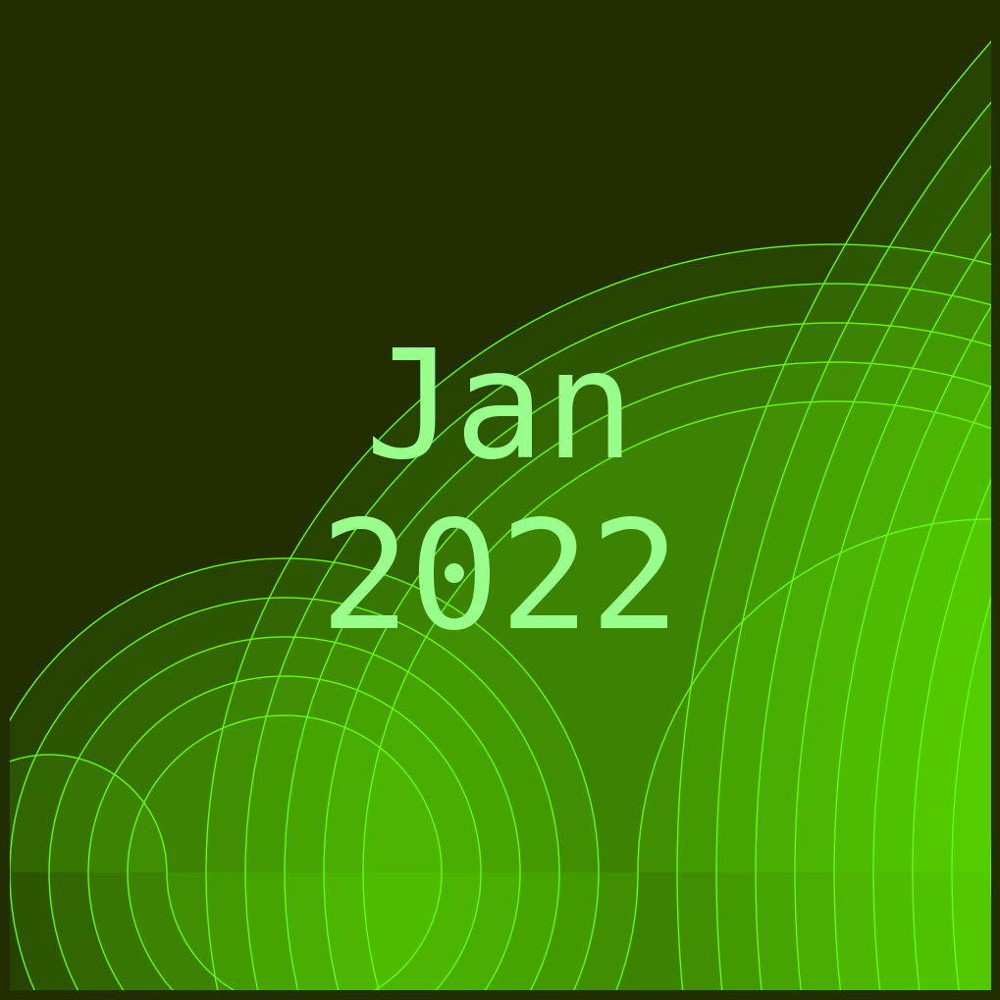
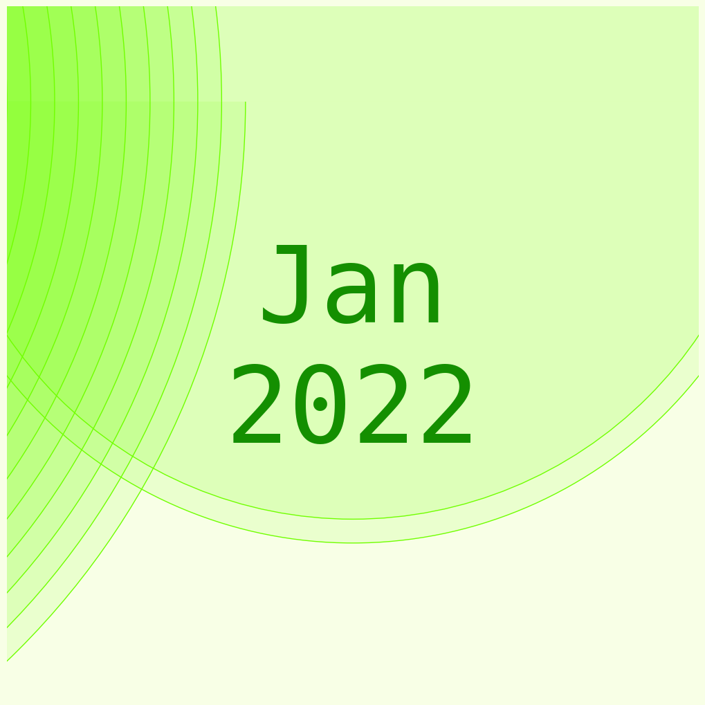

# Your Tops

This is a small Flask server that shows your most listened to tracks / artists in a time scale of either
4 weeks, 6 months or all time. You can also save your current top list to your Spotify

## Configuration
To get this working you need to create a configuration file ``config.py`` with the following structure:

```python
# CLIENT_ID and CLIENT_SECRET can be found in the Spotify Developer Dashboard
CLIENT_ID = "<your_client_id>"
CLIENT_SECRET = "<your_client_secret>"

# REDIRECT_URL needs also to be registered in the Spotify Developer Dashboard
REDIRECT_URI = 'e.g. http://127.0.0.1:5000/auth/callback'

SPOTIFY_API_URL = 'e.g. https://api.spotify.com/v1'

# name for the cookie where the access token is stored
ACCESS_TOKEN_COOKIE = "<your_cookie>"

PORT = 5000
```
After installing the required dependencies just run ``flask run`` and enjoy your top list!

### Scopes
The refresh token needs to have the following scopes: ``playlist-modify-private playlist-modify-public user-top-read ugc-image-upload``


## Example Cover images
Here are some example cover images




